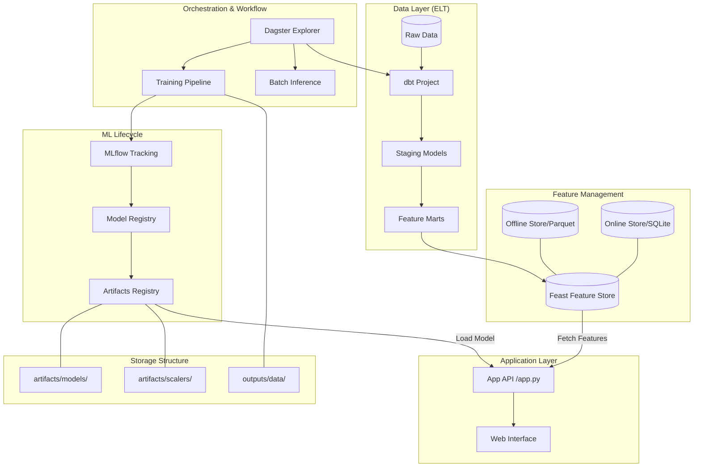

# Project Architecture: ML Research & MLOps

โปรเจกต์นี้ได้รับการออกแบบตามแนวทาง **Modern MLOps Stack (Modern ELT)** เพื่อแยกส่วนของ Data Processing, Feature Management, Orchestration และ Model Serving ออกจากกันอย่างชัดเจน

## 🏗 ภาพรวมสถาปัตยกรรม (Architecture Overview)

---

## 🛠 ส่วนประกอบหลัก (Key Components)

### 1. Data Transformation (`/dbt_project`)
- **dbt (data build tool)**: ใช้สำหรับเปลี่ยนผ่านจาก Python-heavy processing ไปเป็น SQL-based transformation.

### 2. Feature Store (`/feature_repo`)
- **Feast**: จัดการ Feature เพื่อให้เกิดความสอดคล้องกัน (Consistency) ระหว่างช่วง Training (Offline) และ Prediction (Online).

### 3. Orchestration (`/dagster_project`)
- **Dagster**: เป็นตัวควบคุม (Orchestrator) ลำดับการทำงานทั้งหมด (Assets & Ops).

### 4. Experiment Tracking (`/mlruns`)
- **MLflow**: บันทึก Parameters, Metrics และไฟล์ Model Artifacts.

### 5. Serving & UI (`/app`)
- **Web App**: ให้บริการ Prediction API และหน้าจอสำหรับ Dashboard/Training.
- **Artifacts Storage**: 
    - เก็บโมเดลใน `artifacts/models/` 
    - เก็บ Scalers ใน `artifacts/scalers/`
    - เก็บ Metrics/Metadata ใน `outputs/data/`

---

## 🚀 Workflow การทำงาน
1. **Data Prep**: ข้อมูลดิบจะถูก Transform ด้วย `dbt`.
2. **Feature Registration**: นำผลลัพธ์จาก dbt ไปจดทะเบียนใน `Feast`.
3. **Training**: `Dagster` สั่งรัน Training Pipeline, ดึงข้อมูลจาก `Feast`, บันทึกผลลง `MLflow`.
4. **Serving**: `App` โหลดโมเดลและ Scaler ล่าสุดจาก `artifacts/` มาใช้งานร่วมกับ Features จากสโตร์ของ `Feast`.
